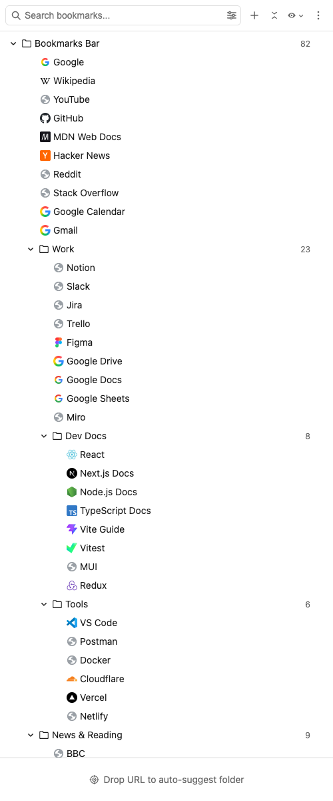
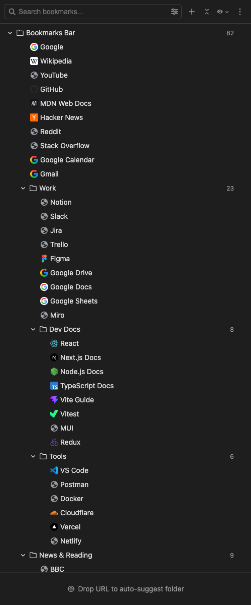
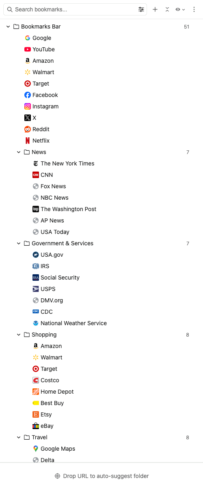
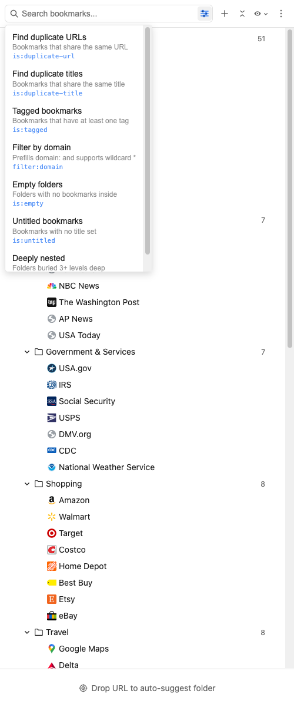
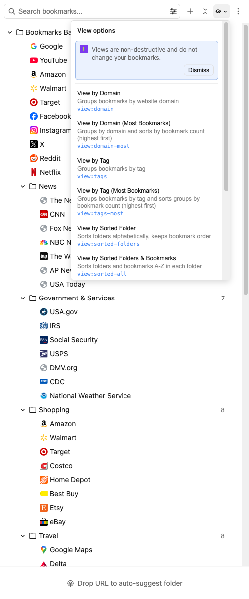
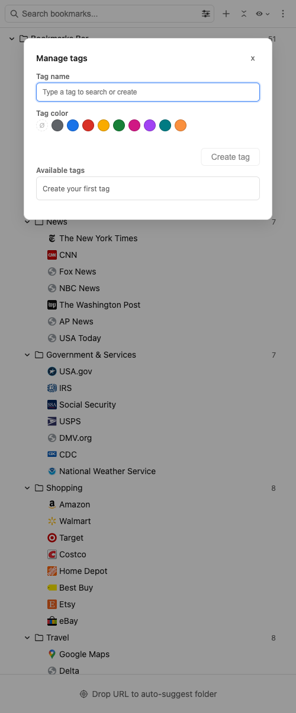
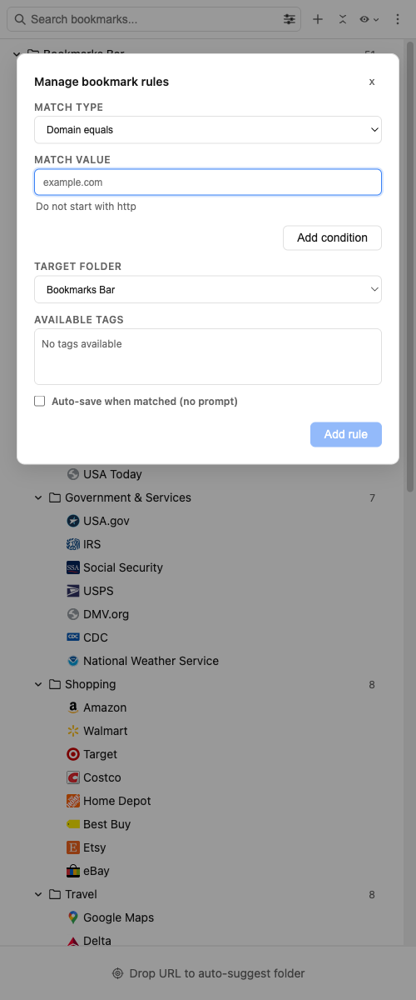

<h1 align="center">
  
  Bookmark Keep
</h1>

Bookmark Keep is a Chrome, Firefox, and Edge side panel extension for organizing and finding bookmarks faster.

Homepage: https://bookmarkkeep.app

###  Chrome

###  Firefox

###  Edge

## Feature Highlights

- Full bookmark tree with fast expand/collapse controls
- Live search with highlights, wildcard support (`*`), and query shortcuts
- Filters and views (duplicates, empty folders, newest/oldest, domain view)
- Tags with quick tagging workflows and tag-based search
- Multi-select with bulk actions (open, move, tag, delete)
- Drag and drop reordering, including cross-folder moves
- Smart drop suggestions for where new URLs should be saved & rule-based logic
- Light and dark appearance modes with localized UI

## Privacy

- No browsing-history API permission required
- No page-content access required
- No third-party API calls required

## Data & Sync

| Data type                    | Primary storage | Fallback / mirror      | Notes                                                                                      |
| ---------------------------- | --------------- | ---------------------- | ------------------------------------------------------------------------------------------ |
| Settings                     | Sync storage    | Local storage fallback | Keeps preferences consistent across signed-in browser profiles when sync is available.     |
| Tags                         | Sync storage    | Local storage fallback | Tag metadata and bookmark-tag mappings sync when supported; local copy is also maintained. |
| Bookmark rules               | Sync storage    | Local storage fallback | Rule definitions sync when available; local copy is also maintained.                       |
| Drag & Drop-learning history | Local storage   | None                   | Device/profile-local learning and recency signals.                                         |

- You can export/import settings, tags, and bookmark rules from the extension menu.
  > Uninstalling can remove local extension data on that browser profile.

> If account sync is disabled/unavailable, sync-backed data may not transfer or be recoverable across devices/profiles.

## Detailed Feature Breakdown

### Bookmark Tree & Organization

- Full hierarchical bookmark tree in the browser sidebar
- Expand/collapse individual folders plus one-click collapse/expand all
- Recursive bookmark/folder stats badges (optional via settings)
- Pin folders to the top of their parent folder for quicker access
- Context menu on every item (`Edit`, `Move`, `Open`, `Sort`, `Duplicate folder`, `Delete`, etc.)
- Folder sorting tools:
  - Sort folders A-Z / Z-A
  - Sort bookmarks A-Z / Z-A / newest / oldest
  - Optional recursive bookmark sorting across subfolders

### Search, Query Syntax & Autocomplete

- Live search across title and URL
- Highlighted text matches
- Wildcard support (`*`) in text/domain/tag matching
- Fuzzy-match fallback when direct matching is weak
- Search command autocomplete with `>` prefixes for:
  - `is` filters
  - `filter` commands
  - `view` commands
- Built-in query aliases (localized) such as:
  - `>is:duplicate-url`, `>is:duplicate-title`
  - `>is:empty`, `>is:untitled`, `>is:nested`, `>is:tagged`, `>is:untagged`
  - `>filter:domain`
  - `>view:domain`, `>view:domain-most`, `>view:tags`, `>view:tags-most`, `>view:newest`, etc.
  - `>tag:<name>` and `>-tag:<name>` (include/exclude tag terms)

### Filters & Views (Non-Destructive)

> Views & filters are applied without rewriting bookmark data

- Filters:
  - Duplicate URLs: `>is:duplicate-url`
    - Finds bookmarks that share the same URL
  - Duplicate titles: `>is:duplicate-title`
    - Finds bookmarks that share the same title
  - Tagged bookmarks: `>is:tagged`
    - Shows only bookmarks with at least one tag
  - Empty folders: `>is:empty`
    - Finds folders with no bookmarks inside
  - Untitled bookmarks: `>is:untitled`
    - Finds bookmarks with no title set
  - Deeply nested folders (3+ levels): `>is:nested`
    - Finds folders buried in deep hierarchies
  - Domain filter: `>filter:domain <domain>`
    - Filters results by domain pattern and supports wildcard `*`
      - example: `>filter:domain google.com` returns bookmarks matching google.com
      - example: `>filter:domain git*.com` returns bookmarks matching github.com and gitlab.com
- Views:
  - By domain: `>view:domain`
    - Groups bookmarks by website domain
  - By domain (most bookmarks first): `>view:domain-most`
    - Groups by domain and sorts domains by bookmark count descending
  - By tag (A-Z): `>view:tags`
    - Groups bookmarks by tag and sorts groups alphabetically
  - By tag (most bookmarks first): `>view:tags-most`
    - Groups bookmarks by tag and sorts groups by bookmark count descending
  - By newest: `>view:newest`
    - Shows bookmarks from newest to oldest
  - By oldest: `>view:oldest`
    - Shows bookmarks from oldest to newest
  - Follow current tab domain: `>view:follow-tab`
    - Shows bookmarks matching the active tab's domain
  - Sorted folders only: `>view:sorted-folders`
    - Sorts folder names A-Z while preserving bookmark order
  - Sorted folders + bookmarks: `>view:sorted-all`
    - Sorts folders and bookmarks A-Z within each folder
  - Privacy mode: `>view:privacy`
    - Blurs titles and URLs in the sidebar UI. Hold `Shift` to temporarily disable

### Tags

- Create, edit, and delete tags
- Optional color-only tags or name + color tags
- Attach/detach tags for single or multi-selected bookmarks
- Filter/search using tag query syntax (`>tag:`, `>-tag:`, `>is:tagged`, `>is:untagged`)
- Clicking a tag pill attached to a bookmark applies `>tag:<tag>` in search
- Context menu quick-tagging with recently used tags:
  - Up to 3 recent tags shown inline
  - Click to toggle on/off for the current bookmark (or current selection)
  - Long labels are truncated safely in menus

### Multi-Select & Bulk Actions

- Checkbox multi-select across bookmarks
- Shift-click range selection
- Bulk open in tabs/windows/tab groups/incognito (with safety confirmation)
- Bulk move
- Bulk tag
- Bulk delete with count confirmation

### Tabs & Tab Groups Integration

> Chrome and Edge additional optional permissions (`tabs` and `tabGroups`) before tab data can be accessed.

- Sidebar `Tabs` section with collapsible buckets:
  - Pinned tabs
  - Tab groups (Chrome)
  - Open tabs
- Click tab rows to focus the existing tab/window
- Tab and tab-group row context menus support bookmarking/closing selections
- Tab group actions:
  - Save tab group as a new bookmark folder
  - Save tab group into an existing folder
  - Copy all URLs
  - Close the group (with confirmation)
- Toolbar actions for:
  - Bookmark all open tabs
  - Bookmark pinned tabs

### Drag & Drop

> Chrome and Edge additional optional permissions (`tabs` and `tabGroups`) before the title of the dragged tab can be used.

- Drag bookmarks/folders to reorder or move between folders
- Multi-item drag with count ghost
- Drop zones above/below/inside with visual indicators
- Drag external URLs into folders to bookmark immediately
- Drag bookmarks to Smart Drop Zone for suggestion-based placement

### Smart Drop Zone & Bookmark Rules

- Drop URL(s) to get ranked folder suggestions
- Ranking signals include:
  - Exact URL matches
  - Same-domain bookmark density
  - Folder keyword relevance
  - Learned behavior from prior saves
  - Recent save destinations
- Confidence labels and “why this folder” explanations
- One-click “save with rule” for domain routing
- Bookmark rules management UI:
  - Match types: domain equals, URL contains, title equals, title contains
  - Set target folder
  - Optional tags to auto-apply
  - Auto-save behavior
  - Enable/disable, reorder, edit, delete bookmark rules

### Recently Added

- Dedicated “Recently Added” section with favicon, relative time, and folder path
- Click path to jump to the bookmark in-tree
- Configurable recent count (10 / 25 / 50 / 100)

### Keyboard & Safety

- Keyboard navigation:
  - `ArrowUp` / `ArrowDown` moves focus between visible rows
  - `ArrowRight` / `ArrowLeft` expands/collapses folders (or moves parent/child focus)
  - `Enter` opens focused bookmark or toggles focused folder
  - `Space` toggles the focused row checkbox (when selectable)
  - `Delete` / `Backspace` deletes current selection, or deletes the focused bookmark when nothing is selected
- Mouse modifiers for open behavior:
  - `Cmd/Ctrl+Click` opens in new tab
  - `Shift+Click` opens in new window (or tab fallback)
- Large-open confirmation threshold (configurable)
- Confirmations for destructive operations (delete, close group, etc.)

### Runtime Behavior

- Reacts to external bookmark changes (create/remove/update/move)
- Reacts to tab/tab-group lifecycle changes in near real time
- Works without third-party network APIs or page-content access

## Browser Feature Matrix

| Capability                            | Chrome                                                               | Edge                                                                 | Firefox             |
| ------------------------------------- | -------------------------------------------------------------------- | -------------------------------------------------------------------- | ------------------- |
| Tabs section                          | Yes                                                                  | Yes                                                                  | Yes                 |
| Tab groups support in sidebar/actions | Yes                                                                  | Yes                                                                  | No (API limitation) |
| Split view actions                    | Yes                                                                  | Yes                                                                  | No                  |
| Incognito/private window actions      | Supported when browser allows it and extension permission is granted | Supported when browser allows it and extension permission is granted | Not available       |

## Permissions Behavior

- In Chrome/Edge, using or enabling tab-powered features can trigger an optional permission request for `tabs` and `tabGroups`.
- The permission prompt appears on first tab-feature enable/use (for example, enabling Tabs-related settings or invoking tab actions).
- If permission is declined, Tabs-related features remain disabled until permission is granted later.

## Known Limitations

- Firefox tab-groups metadata/actions are unavailable due to browser API limitations.
- Some tab actions require optional permissions and will not run until granted.
- Auto-save bookmark rule behavior differs when the sidebar is closed vs open (depending on the setting).

## Detailed Options

### Settings Options

#### Features

| Setting                | What it does                                                                 | Values                  | Default |
| ---------------------- | ---------------------------------------------------------------------------- | ----------------------- | ------- |
| `Tabs`                 | Shows or hides the tabs section in the sidebar.                              | On / Off                | Off     |
| `Pinned Tabs`          | Shows or hides pinned tabs in the tabs section.                              | On / Off                | Off     |
| `Tab Groups`           | Shows or hides tab groups in the tabs section (Chrome/Edge).                 | On / Off (Chrome/Edge)  | Off     |
| `Open Tabs`            | Shows or hides regular open tabs in the tabs section.                        | On / Off                | Off     |
| `Recently Added`       | Shows or hides the Recently Added bookmarks section.                         | On / Off                | On      |
| `Recently added count` | Controls how many recent bookmarks are shown when Recently Added is enabled. | `10`, `25`, `50`, `100` | `10`    |
| `Drop zone`            | Shows or hides the drop target used for URL auto-suggest save flows.         | On / Off                | On      |
| `Show Counts`          | Shows or hides bookmark and folder counts in lists.                          | On / Off                | On      |

#### Look & Feel

| Setting                            | What it does                                                                          | Values                                                                                                                           | Default                |
| ---------------------------------- | ------------------------------------------------------------------------------------- | -------------------------------------------------------------------------------------------------------------------------------- | ---------------------- |
| `Language`                         | Overrides the extension UI language independently of browser language.                | `Use browser language` or one of: `de`, `en_CA`, `en_US`, `es`, `fr`, `fr_CA`, `it`, `ja`, `ko`, `nl`, `pt_BR`, `zh_CN`, `zh_TW` | `Use browser language` |
| `Appearance`                       | Chooses whether the extension follows system colors or forces light/dark mode.        | `System`, `Light`, `Dark`                                                                                                        | `System`               |
| `Theme`                            | Changes bookmark/folder icon styling set.                                             | `Default`, `Classic`, `Bookmark Keep`                                                                                            | `Default`              |
| `Density`                          | Adjusts list spacing and compactness.                                                 | `Default`, `Comfortable`, `Compact`                                                                                              | `Default`              |
| `Sync with tab zoom`               | Matches sidebar text size to the active tab zoom level.                               | On / Off                                                                                                                         | On                     |
| `Auto-close in fullscreen`         | Automatically closes the sidebar when a page enters fullscreen mode.                  | On / Off                                                                                                                         | On                     |
| `Run rules when sidebar is closed` | Runs enabled auto-save bookmark rules in the background when the sidebar is not open. | On / Off                                                                                                                         | Off                    |

#### Other

| Setting                           | What it does                                                           | Values                                   | Default |
| --------------------------------- | ---------------------------------------------------------------------- | ---------------------------------------- | ------- |
| `Large open warning`              | Sets the confirmation threshold before opening many bookmarks at once. | `5`, `10`, `25`, `50`, `100` bookmarks   | `5`     |
| `Reset info and warning messages` | Re-shows previously dismissed informational/warning notices.           | Button action (resets dismissed notices) | N/A     |

## Screenshots

### Overview

| Light                                                           | Dark                                                          |
| --------------------------------------------------------------- | ------------------------------------------------------------- |
|  |  |

### Feature Gallery

| Tree                                                  | Filters                                                | Views                                              |
| ----------------------------------------------------- | ------------------------------------------------------ | -------------------------------------------------- |
|  |  |  |

| Manage Tags                                                    | Manage Rules                                                     |
| -------------------------------------------------------------- | ---------------------------------------------------------------- |
|  |  |

## Locales

- 🇺🇸 English (`en_US`)
- 🇨🇦 English (`en_CA`)
- 🇩🇪 Deutsch (`de`)
- 🇪🇸 Español (`es`)
- 🇫🇷 Français (`fr`)
- 🇨🇦 Français (`fr_CA`)
- 🇮🇹 Italiano (`it`)
- 🇯🇵 日本語 (`ja`)
- 🇰🇷 한국어 (`ko`)
- 🇳🇱 Nederlands (`nl`)
- 🇧🇷 Português (`pt_BR`)
- 🇨🇳 简体中文 (`zh_CN`)
- 🇹🇼 繁體中文 (`zh_TW`)

## Report A Bug

Open an issue here:

- https://github.com/bookmarkkeep/bookmarkkeep-issues/issues

When filing, include:

- Browser and browser version
- Extension version
- Locale
- Whether tab permissions were granted (if issue involves tabs/tab groups)
- Exact reproduction steps
- Expected behavior vs actual behavior
- Console logs and screenshots/screen recording when possible

## Useful Links

- Website: https://bookmarkkeep.app
- Chrome Web Store listing: https://chromewebstore.google.com/detail/bookmark-keep/fblbobhgdajahefnbkpbdeienmpnhado
- Firefox Add-ons listing: https://addons.mozilla.org/en-CA/firefox/addon/bookmark-keep
- Edge Add-ons listing: https://microsoftedge.microsoft.com/addons/detail/bookmark-keep/ijdbpjibkibglmodalmcgclicblemkbh
